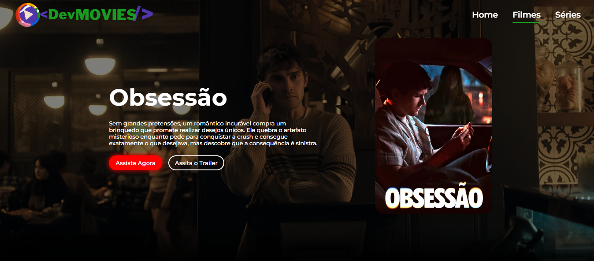
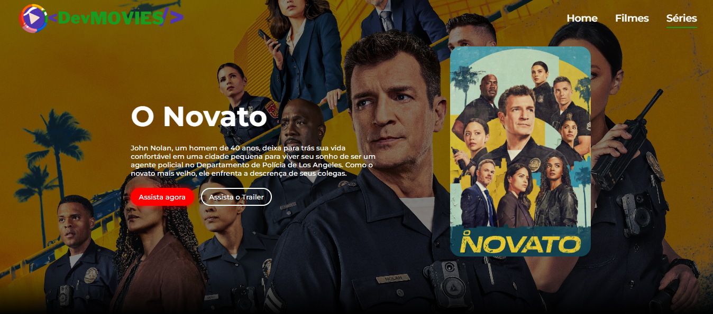
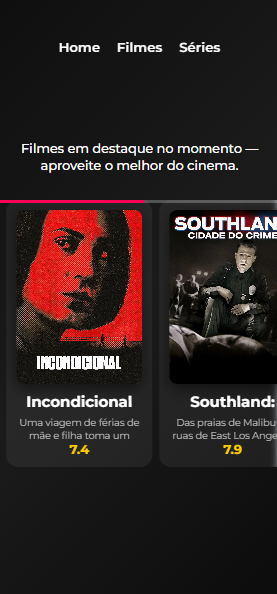
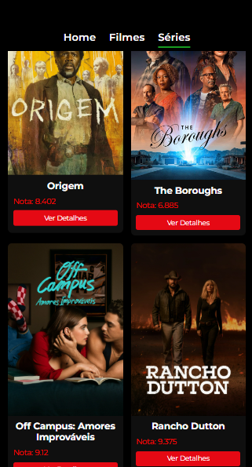

# Dev-Movies

**Status**: Em desenvolvimento (versão inicial funcional)

## Sobre o projeto

Dev-Movies é uma aplicação front-end de portfólio que simula a experiência de uma plataforma de streaming de vídeo. Inspirada em serviços reais como Netflix e Prime Video, a aplicação oferece navegação entre páginas de Home, Filmes e Séries, exibição de conteúdos em destaque e uma interface responsiva. O projeto consome dados da API pública do TMDB (The Movie Database) para popular o catálogo.

## Funcionalidades

- Navegação entre páginas Home, Filmes e Séries
- Exibição de filmes e séries em destaque (banners e carrosséis)
- Listagem de conteúdos por categoria (gêneros)
- Interface responsiva adaptada para dispositivos móveis e desktop
- Consumo de API externa (TMDB) com tratamento de erros básico
- Persistência de dados em cache para melhor performance

## Tecnologias utilizadas

- **JavaScript** (ES6+)
- **React** (com hooks)
- **Node.js** (para gerenciamento de dependências)
- **Styled Components**
- **Git** e **GitHub**
- **Vite** (bundler)
- **react-router-dom** (roteamento)
- **axios** (requisições HTTP)
- **swiper** (carrosséis)

## Como executar o projeto

Pré-requisitos: Node.js (versão 14 ou superior) e npm ou yarn.
```bash
# Clone o repositório
git clone https://github.com/seu-usuario/dev-movies.git

# Acesse o diretório
cd dev-movies

# Instale as dependências
yarn

# Configure as variáveis de ambiente
# Crie um arquivo .env na raiz com:
VITE_TMDB_API_KEY=suachaveaqui
VITE_TMDB_BASE_URL=https://api.themoviedb.org/3

# Inicie o servidor de desenvolvimento
yarn dev
```
Organização do projeto

├── components/        Componentes reutilizáveis

├── containers/        Componentes conectados ao estado/API

├── layout/            Layout padrão (header, footer)

├── routes/            Definição das rotas

├── services/          Chamadas à API (axios)

└── App.jsx            Componente principal

O que o projeto demonstra
Construção de aplicação front-end com fluxo completo de navegação
Organização de código por responsabilidade (components, containers, services)
Integração com API externa e tratamento de dados assíncronos
Uso prático de React, Styled Components, roteamento e consumo de APIs
Estrutura pensada para manutenção e evolução.

Melhorias futuras
Aprimorar o tratamento de erros (exibição de mensagens amigáveis)

Criar deploy automatizado (Vercel, Netlify ou GitHub Pages)

Fotos do projetoAbaixo estão algumas imagens do Dev-Movies para apresentar a interface do projeto:

Tela inicial


Página de filmes




Página de séries




Versão mobile

  
